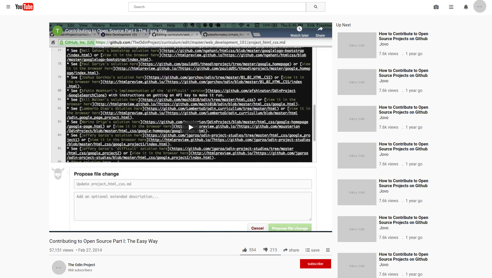

# Youtube Clone

> Here we learn about adding a video in an html page.

## Live Demo

[Live Demo Link](https://livedemo.com)

## Built With

- HTML,
- Css,

## Getting Started

Open index.html file in your browser.

## Authors

👤 **Mohab**

- Github: [@githubhandle](https://github.com/mohabakram)

👤 **Olawale**

- Github: [@githubhandle](https://github.com/OlawaleJoseph)

## 🤝 Contributing

Contributions, issues and feature requests are welcome!

Feel free to check the [issues page](issues/).

## Show your support

Give a ⭐️ if you like this project!

## Acknowledgments

- Hat tip to anyone whose code was used
- Inspiration
- etc

## 📝 License

This project is [MIT](lic.url) licens
